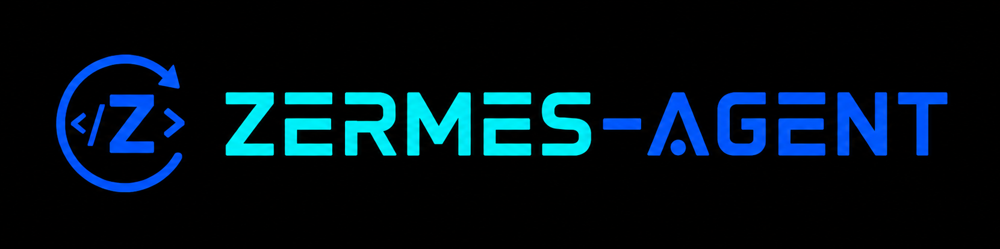

<p align="center">
  
</p>

# Zermes ☤

<p align="center">
  <a href="https://hermes-agent.nousresearch.com/docs/"></a>
  <a href="https://discord.gg/NousResearch"></a>
  <a href="https://github.com/NousResearch/hermes-agent/blob/main/LICENSE"></a>
  <a href="https://nousresearch.com"></a>
  <a href="README.md"></a>
</p>

**由 [Nous Research](https://nousresearch.com) 构建的自改进 AI Agent。** 它内置学习闭环：从经验中创建技能，在使用中改进技能，主动提醒自己持久化知识，搜索自己的历史对话，并在跨会话中逐步形成对你的深入理解。你可以把它运行在 5 美元 VPS、GPU 集群，或空闲时几乎不产生成本的 Serverless 基础设施上。它不绑定你的笔记本电脑；你可以在 Telegram 上和它对话，同时让它在云端 VM 上工作。

Zermes 是 Hermes Agent 的一个分支，重点面向有治理约束的自改进工作流。为便于迁移，它在必要处保留 Hermes 兼容的内部结构和 CLI 别名；新的首选命令和数据目录是 `zermes` 与 `~/.zermes`。

可以使用你想要的任何模型：[Nous Portal](https://portal.nousresearch.com)、[OpenRouter](https://openrouter.ai)（200+ 模型）、[NVIDIA NIM](https://build.nvidia.com)（Nemotron）、[小米 MiMo](https://platform.xiaomimimo.com)、[z.ai/GLM](https://z.ai)、[Kimi/Moonshot](https://platform.moonshot.ai)、[MiniMax](https://www.minimax.io)、[Hugging Face](https://huggingface.co)、OpenAI，或你自己的端点。使用 `zermes model` 即可切换；无需改代码，也不会被单一提供商锁定。

<table>
<tr><td><b>真正的终端界面</b></td><td>完整 TUI，支持多行编辑、斜杠命令自动补全、对话历史、中断并改向，以及流式工具输出。</td></tr>
<tr><td><b>出现在你所在的地方</b></td><td>Telegram、Discord、Slack、WhatsApp、Signal 和 CLI 都由同一个网关进程接入。支持语音备忘录转写和跨平台对话连续性。</td></tr>
<tr><td><b>闭环学习</b></td><td>Agent 管理记忆并定期发出提醒。复杂任务后可自动创建技能。技能会在使用中自我改进。FTS5 会话搜索配合 LLM 摘要实现跨会话回忆。支持 <a href="https://github.com/plastic-labs/honcho">Honcho</a> 辩证式用户建模。兼容 <a href="https://agentskills.io">agentskills.io</a> 开放标准。</td></tr>
<tr><td><b>定时自动化</b></td><td>内置 cron 调度器，可投递到任意平台。日报、夜间备份、每周审计都可以用自然语言描述并无人值守运行。</td></tr>
<tr><td><b>委派与并行</b></td><td>生成隔离子 Agent 处理并行工作流。也可以编写通过 RPC 调用工具的 Python 脚本，把多步管道压缩成零上下文成本的轮次。</td></tr>
<tr><td><b>有治理的自进化</b></td><td>代码改进请求会进入审批优先的工作流，包含审计文件、专用分支、显式文件提交、验证记录、 advisory thinking 报告，以及仓库本地的低 token 分析上下文。</td></tr>
<tr><td><b>随处运行，不限于你的笔记本</b></td><td>七种终端后端：local、Docker、SSH、Singularity、Modal、Daytona 和 Vercel Sandbox。Daytona 与 Modal 提供 Serverless 持久化，Agent 环境空闲时休眠、按需唤醒，会话间几乎不产生成本。它可以运行在 5 美元 VPS 或 GPU 集群上。</td></tr>
<tr><td><b>面向研究</b></td><td>支持批量轨迹生成、Atropos RL 环境，以及用于训练下一代工具调用模型的轨迹压缩。</td></tr>
</table>

---

## 快速安装

### Zermes 源码运行时安装器

Zermes 正在迁移到源码安装器模型。该模型会分离软件安装目录与用户数据，并为有治理的自进化准备稳定的运行时布局：

```bash
python install.py install
```

安装器使用 `<prefix>/runtime/releases/source-install/` 保存当前活动的源码 release，使用 `<prefix>/bin/zermes` 作为启动器，并使用 `~/.hermes` 或自定义 `--data-dir` 保存用户配置、会话、技能和日志。下面的旧安装器仍然可用，但它们会从源码 checkout 和树内虚拟环境运行；在新的运行时安装器完成前，更适合作为兼容路径或开发者路径。

更新已安装的源码运行时必须来自显式 checkout：

```bash
python install.py update --prefix <prefix> --source <source-dir>
python install.py update --prefix <prefix> --current-source
```

`--source` 指向选定的 checkout；`--current-source` 使用包含 `install.py` 的 checkout。非交互更新必须提供二者之一。更新会先构建 `runtime/candidates/<candidate-id>/` 并写入 `update-state.json`；验证通过后，`--activate` 会切换 `active.json`。使用 `--no-activate` 可以只保留候选版本。`python install.py rollback --prefix <prefix>` 会把 `active.json` 指回 `previous.json`，但不会删除 release。`--restart` 会写入受治理的 `runtime/restart-intent.json`；受安装器管理的 CLI 会在当前对话结束后消费它，gateway 会在回复投递后消费它并走已有 drain-aware 重启路径。安装器仍不会强杀正在运行的进程。

卸载源码运行时：

```bash
python install.py uninstall --prefix <prefix>
```

卸载默认只移除软件安装目录，并保留 `active.json` 中记录的用户 `data_dir`。如需同时删除用户数据目录，添加 `--remove-data`；如需清理安装器创建的用户级全局 `zermes` 命令，添加 `--remove-global-command`。

### Linux、macOS、WSL2、Termux

```bash
curl -fsSL https://raw.githubusercontent.com/NousResearch/hermes-agent/main/scripts/install.sh | bash
```

### Windows（原生 PowerShell）— Early Beta

> **提醒：** 原生 Windows 支持仍处于 **early beta**。它可以安装和运行，但没有 Linux、macOS、WSL2 路径经过同等程度的验证。遇到问题请[提交 issue](https://github.com/NousResearch/hermes-agent/issues)。目前最稳妥的 Windows 方案是在 **WSL2** 中运行上面的 Linux/macOS 一行安装命令。

在 PowerShell 中运行：

```powershell
irm https://raw.githubusercontent.com/NousResearch/hermes-agent/main/scripts/install.ps1 | iex
```

安装器会处理所有依赖：uv、Python 3.11、Node.js、ripgrep、ffmpeg，以及一个便携 Git Bash（MinGit，解压到 `%LOCALAPPDATA%\hermes\git`；不需要管理员权限，也不会影响系统 Git）。Hermes 使用这个随附的 Git Bash 运行 shell 命令。

如果系统已经安装 Git，安装器会检测并使用它。否则只需要下载约 45MB 的 MinGit；它不会触碰或干扰任何系统 Git。

> **Android / Termux：** 已验证的手动路径见 [Termux 指南](https://hermes-agent.nousresearch.com/docs/getting-started/termux)。在 Termux 上，Hermes 会安装精简的 `.[termux]` extra，因为完整 `.[all]` extra 当前会拉取 Android 不兼容的语音依赖。
>
> **Windows：** 原生 Windows 支持是 **early beta**。上面的 PowerShell 一行命令会安装所有内容，但仍可能遇到边角问题；请在遇到问题时提交 issue。如果更愿意使用 WSL2（目前验证最充分的 Windows 路径），也可以在 WSL2 中运行 Linux 命令。原生 Windows 安装在 `%LOCALAPPDATA%\hermes` 下；WSL2 与 Linux 一样安装在 `~/.hermes` 下。目前唯一明确需要 WSL2 的 Hermes 功能是基于浏览器的 dashboard chat pane，因为它使用 POSIX PTY；经典 CLI 和 gateway 都可以在原生 Windows 运行。

安装后：

```bash
source ~/.bashrc    # 重新加载 shell（或: source ~/.zshrc）
zermes              # 开始对话！
```

---

## 快速入门

```bash
zermes              # 交互式 CLI — 开始对话
zermes model        # 选择 LLM 提供商和模型
zermes tools        # 配置启用的工具
zermes config set   # 设置单个配置值
zermes gateway      # 启动消息网关（Telegram、Discord 等）
zermes setup        # 运行完整设置向导（一次性完成配置）
zermes claw migrate # 从 OpenClaw 迁移（如果你来自 OpenClaw）
zermes update       # 更新到最新版本
zermes doctor       # 诊断问题
```

📖 **[完整文档 →](https://hermes-agent.nousresearch.com/docs/)**

## CLI 与消息平台快速对照

Zermes 有两个入口：用 `zermes` 启动终端 UI，或者运行 gateway 后从 Telegram、Discord、Slack、WhatsApp、Signal 或 Email 与它对话。进入对话后，许多斜杠命令在两种界面中通用。旧的 `hermes` 命令仍作为兼容别名可用。

| 操作 | CLI | 消息平台 |
|------|-----|----------|
| 开始对话 | `zermes` | 运行 `zermes gateway setup` + `zermes gateway start`，然后给机器人发消息 |
| 开始全新对话 | `/new` 或 `/reset` | `/new` 或 `/reset` |
| 更换模型 | `/model [provider:model]` | `/model [provider:model]` |
| 设置人格 | `/personality [name]` | `/personality [name]` |
| 重试或撤销上一轮 | `/retry`、`/undo` | `/retry`、`/undo` |
| 压缩上下文 / 查看用量 | `/compress`、`/usage`、`/insights [--days N]` | `/compress`、`/usage`、`/insights [days]` |
| 浏览技能 | `/skills` 或 `/<skill-name>` | `/<skill-name>` |
| 中断当前工作 | `Ctrl+C` 或发送新消息 | `/stop` 或发送新消息 |
| 平台特定状态 | `/platforms` | `/status`、`/sethome` |

完整命令列表见 [CLI 指南](https://hermes-agent.nousresearch.com/docs/user-guide/cli) 和 [Messaging Gateway 指南](https://hermes-agent.nousresearch.com/docs/user-guide/messaging)。

---

## 文档

所有文档位于 **[hermes-agent.nousresearch.com/docs](https://hermes-agent.nousresearch.com/docs/)**：

| 章节 | 覆盖内容 |
|------|----------|
| [Quickstart](https://hermes-agent.nousresearch.com/docs/getting-started/quickstart) | 安装 → 设置 → 2 分钟内开始第一次对话 |
| [CLI Usage](https://hermes-agent.nousresearch.com/docs/user-guide/cli) | 命令、快捷键、人格、会话 |
| [Configuration](https://hermes-agent.nousresearch.com/docs/user-guide/configuration) | 配置文件、提供商、模型和所有选项 |
| [Messaging Gateway](https://hermes-agent.nousresearch.com/docs/user-guide/messaging) | Telegram、Discord、Slack、WhatsApp、Signal、Home Assistant |
| [Security](https://hermes-agent.nousresearch.com/docs/user-guide/security) | 命令审批、DM 配对、容器隔离 |
| [Tools & Toolsets](https://hermes-agent.nousresearch.com/docs/user-guide/features/tools) | 40+ 工具、工具集系统、终端后端 |
| [Skills System](https://hermes-agent.nousresearch.com/docs/user-guide/features/skills) | 过程记忆、Skills Hub、创建技能 |
| [Memory](https://hermes-agent.nousresearch.com/docs/user-guide/features/memory) | 持久记忆、用户画像、最佳实践 |
| [MCP Integration](https://hermes-agent.nousresearch.com/docs/user-guide/features/mcp) | 连接任意 MCP server 以扩展能力 |
| [Cron Scheduling](https://hermes-agent.nousresearch.com/docs/user-guide/features/cron) | 带平台投递的定时任务 |
| [Context Files](https://hermes-agent.nousresearch.com/docs/user-guide/features/context-files) | 影响每次对话的项目上下文 |
| [Architecture](https://hermes-agent.nousresearch.com/docs/developer-guide/architecture) | 项目结构、Agent loop、关键类 |
| [Contributing](https://hermes-agent.nousresearch.com/docs/developer-guide/contributing) | 开发环境、PR 流程、代码风格 |
| [CLI Reference](https://hermes-agent.nousresearch.com/docs/reference/cli-commands) | 所有命令和 flag |
| [Environment Variables](https://hermes-agent.nousresearch.com/docs/reference/environment-variables) | 完整环境变量参考 |

---

## 从 OpenClaw 迁移

如果你来自 OpenClaw，Hermes 可以自动导入你的设置、记忆、技能和 API key。

**首次设置时：** 设置向导（`hermes setup`）会自动检测 `~/.openclaw`，并在配置开始前提供迁移选项。

**安装后的任意时间：**

```bash
hermes claw migrate              # 交互式迁移（完整 preset）
hermes claw migrate --dry-run    # 预览将要迁移的内容
hermes claw migrate --preset user-data   # 迁移时不包含 secrets
hermes claw migrate --overwrite  # 覆盖已有冲突
```

会导入的内容：

- **SOUL.md** — 人格文件
- **Memories** — MEMORY.md 和 USER.md 条目
- **Skills** — 用户创建的技能 → `~/.hermes/skills/openclaw-imports/`
- **Command allowlist** — 审批模式
- **Messaging settings** — 平台配置、允许用户、工作目录
- **API keys** — allowlist 中的 secrets（Telegram、OpenRouter、OpenAI、Anthropic、ElevenLabs）
- **TTS assets** — 工作区音频文件
- **Workspace instructions** — AGENTS.md（通过 `--workspace-target`）

使用 `hermes claw migrate --help` 查看所有选项，或使用 `openclaw-migration` skill 进行带 dry-run 预览的交互式 Agent 引导迁移。

---

## 自进化工作流

Zermes 包含一个有治理的自进化工作流，用于改进它自己的代码库。该工作流刻意保持保守：

- `complete_code_task` 创建变更前审批计划和审计记录；它不会修改产品代码。
- 已批准的工作会从专用的 `self-evolution/dev/<task_id>` 分支开始。
- 提交必须暂存显式文件列表，不能使用宽泛的工作树暂存。
- 最终集成前会记录验证计划和验证结果。
- `self_evolution_thinking` 可以创建 advisory candidate reports，但绝不执行代码变更。
- 低 token 分析上下文只从本仓库内的文件构建，并缓存到 `<install_prefix>/data/self-evolution/analysis-cache/`。
- 审批计划和最终报告会跟踪文档同步候选项，以便面向用户的变化可以反映到仓库文档中。

生成的 analysis-cache 内容属于安装内运行状态，不提交到 git。

---

## 贡献

欢迎贡献！请参阅 [Contributing Guide](https://hermes-agent.nousresearch.com/docs/developer-guide/contributing) 了解开发环境、代码风格和 PR 流程。

贡献者快速开始：克隆仓库并运行 `setup-hermes.sh`：

```bash
git clone https://github.com/NousResearch/hermes-agent.git
cd hermes-agent
./setup-hermes.sh     # 安装 uv，创建 venv，安装 .[all]，并链接 ~/.local/bin/hermes
./hermes              # 自动检测 venv，无需先 source
```

`setup-hermes.sh` 仍然是贡献者/开发者 bootstrap。对于长期运行的 Zermes 安装，随着源码运行时安装器成熟，建议优先使用该路径，因为它会把运行代码放在 `<prefix>/runtime/releases/` 下，而不是可变的开发 checkout 中。

手动路径（与上面等价）：

```bash
curl -LsSf https://astral.sh/uv/install.sh | sh
uv venv .venv --python 3.11
source .venv/bin/activate
uv pip install -e ".[all,dev]"
scripts/run_tests.sh
```

> **RL Training（可选）：** RL/Atropos 集成位于 `environments/`；完整设置见 [`CONTRIBUTING.md`](https://github.com/NousResearch/hermes-agent/blob/main/CONTRIBUTING.md#development-setup)。

---

## 社区

- 💬 [Discord](https://discord.gg/NousResearch)
- 📚 [Skills Hub](https://agentskills.io)
- 🐛 [Issues](https://github.com/NousResearch/hermes-agent/issues)
- 🔌 [HermesClaw](https://github.com/AaronWong1999/hermesclaw) — 社区微信桥接：在同一微信账号上运行 Hermes Agent 和 OpenClaw。

---

## 许可证

MIT — 详见 [LICENSE](LICENSE)。

由 [Nous Research](https://nousresearch.com) 构建。
